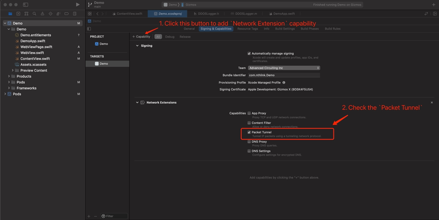

# This is a demo project which contains the steps to create App with TunnelRay library

## Environment requirements:
- XCode: > 13.1
- [Cocoapods](https://guides.cocoapods.org/using/getting-started.html): > 1.11.2

## Detail steps

### Part 1: Create a new project with the `TunnelRay` library imported, and add some demo used UI
1. Open the XCode, create a new `App` project. like below  
    

2. **Close the XCode**, go to the project folder, create a new file named `Podfile` with the following content:
```pod
source 'https://github.com/CocoaPods/Specs.git'
platform :ios, '13.0'

## change to your target name
target 'Demo' do
    use_frameworks!
    pod 'TunnelRay', '>= 1.0.16'
end 
```

3. Run the following command to install the dependencies.
```bash
$ pod install
$ open -a xcode Demo.xcworkspace
```
> Note: please always open your project with {Name}.xcworkspace instead of {Name}.xcodeproj

4. Drag the following files from this project to your project under the corresponding location, and check the `Copy item if needed`:
    - Demo/Demo/ContentView.swift
    - Demo/Demo/WebView.swift
    - Demo/Demo/WebViewPage.swft  
    

### Part 2: Create entitlements and Extension:

1. Add an entitlment via **Signing & Capability**.  
    

2. Add **Network Extension** as a new target with name `tunnel-extension`  
      
    

3. After the extension created, set up the entitlement to match the app on the extension like following:  
    

4. Remove the `PacketTunnelProvider,swift` and Copy the following items from the this project to your project by dragging.  
    - tunnel-extension/PacketTunnelProvider.swift
    - tunnel-extension/libleaf/*
    - tunnel-extension/Subnet.swift
    - tunnel-extension/TunnelRay-Bridging-Header.h
    - tunnel-extension/TunnelRayTunnelStore.swift

5. Append the following changed to the Podfile, and re-run the `pod install` command
```
target 'tunnel-extension' do
    use_frameworks!
    pod 'TunnelRay', '>= 1.0.16'
end 
```

6. Add Objective-C Bridging Header  
    

### Part 3: Running on the real device.

1. Connect your device.  
2. Select the App target and run.  
    
