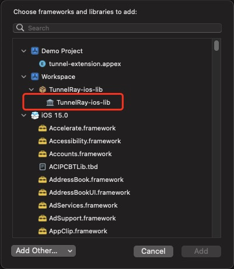

# This is a demo project which contains the steps to create App with TunnelRay library

## Environment requirements:
- XCode: > 13.1
- [Cocoapods](https://guides.cocoapods.org/using/getting-started.html): > 1.11.2

## Detail steps

### Part 1: Create a new project with the `TunnelRay` library imported, and add some demo used UI
1. Open the XCode, create a new `App` project. like below  
    

2. Right click on the project and select `Add Packages` -> "Add Local.." and then navigate to the `TunnelRay-ios-lib` folder and click `Add package`  
    

3. Go to the `Demo` target, and add new libraries under the `Frameworks, Libraries, and Embedded Content`, select `TunnelRay-ios-lib`  
    

4. Drag the following files from this project to your project under the corresponding location, and check the `Copy item if needed`: (Remove the original `ContentView.swft` file firstly)
    - Demo/Demo/ContentView.swift
    - Demo/Demo/WebView.swift
    - Demo/Demo/WebViewPage.swft  
    

### Part 2: Create entitlements and Extension:

1. Add an entitlment via **Signing & Capability**.  
    

2. Add **Network Extension** as a new target with name `tunnel-extension`  
      
    

3. After the extension created, set up the entitlement to match the app on the extension like following:  
    

4. Remove the `PacketTunnelProvider.swift` and Copy the following items from the this project to your project by dragging.  
    - tunnel-extension/PacketTunnelProvider.swift
    - tunnel-extension/libleaf/*
    - tunnel-extension/Subnet.swift
    - tunnel-extension/TunnelRay-Bridging-Header.h
    - tunnel-extension/TunnelRayTunnelStore.swift

5. Import the `TunnelRay-ios-lib` library on the target `tunnel-extension` by following the same process as #Part1.3

6. Add Objective-C Bridging Header "`$(SRCROOT)/tunnel-extension/TunnelRay-Bridging-Header.h`"  
    

### Part 3: Running on the real device.

1. Connect your device.  
2. Select the App target and run.  
    
